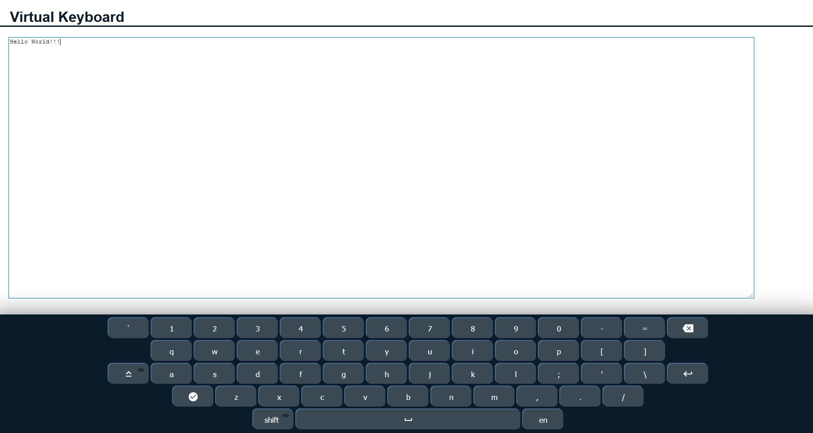

# RSschool_virtual-keyboard
This is task from RSschool (https://rs.school/js/)
## RSS Виртуальная клавиатура
#### my realisation (https://thirsty-easley-eab5b1.netlify.app/)

##### Базовая функциональность:

    - При клике мышкой по клавишам с символами, эти символы отображаются в окне ввода текста. Есть клавиша пробел
    - Есть клавиша CapsLock, переводящая все буквы в верхний регистр. Активное и неактивное состояние клавиши отличаются
    визуально
    - Есть клавиша Backspace, удаляющая символы перед курсором. Есть клавиша Enter для перехода на новую строку
    - Клавиатуру можно скрыть и отобразить на экране
    - В окне для ввода текста сохраняются все возможности обычной физической клавиатуры: текст можно набирать, выделять,
    удалять, добавлять текст в средину строки и т.д. При вводе текста с физической клавиатуры, текст может набираться 
    как на языке виртуальной клавиатуры (предпочтительный вариант), так и на языке, который в данный момент указан
    в операционной системе
    - В окне для ввода текста отображается текущая позиция курсора в виде вертикальной мигающей чёрточки

##### Клавиша Shift:

    - Клавиша Shift меняет регистр букв - строчные переводит в заглавные, заглавные (при зажатой CapsLock) переводит
    в строчные
    - Клавиша Shift позволяет выводить дополнительные символы вместо цифр и символов основной раскладки
    - Активное и неактивное состояние клавиши Shift отличаются визуально
    - Переключение клавиши Shift происходит по клику, аналогично тому, как переключается состояние клавиши CapsLock
    в исходном проекте

##### Смена языка en/ru

    - Для смены языка добавлена дополнительная клавиша en/ru, при клике по которой происходит переключение между
    русской и английской раскладкой клавиатуры
    - При переключении языка на клавише en/ru отображается установленный в данный момент язык
    - При переключении языка на других клавишах клавиатуры отображаются символы выбранного языка, при кликам по ним
    эти символы выводятся в окно для ввода текста
    - При зажатой клавише Shift на клавишах отображаются и в окне для ввода текста выводятся дополнительные символы
    соответствующей раскладки

##### Горизонтальные стрелки для перемещения в пределах строки:

    - Для перемещения в пределах строки добавлены стрелки влево-вправо клики по которым реализуют горизонтальную 
    навигацию курсора. Визуально позиция курсора отображается в виде вертикальной мигающей чёрточки
    - После перемещения позиции курсора ввод/удаление текста происходит по текущей позиции курсора 
    в т.ч. внутри строки

##### Подсветка клавиш виртуальной клавиатуры при кликах по клавишам физической клавиатуры:

    - Нажатие на клавиши физической клавиатуры подсвечивает соответствующие алфавитно-цифровые клавиши, клавиши с 
    символами, клавишу пробел виртуальной клавиатуры
    - Символы нажатых алфавитно-цифровых клавиш, клавиш с символами и пробел выводятся в окне для ввода текста
    - Нажатие на клавиши Shift, CapsLock, Backspace, Enter физической клавиатуры подсвечивает соответствующие 
    клавиши виртуальной клавиатуры, переводит клавиши Shift и CapsLock в активное состояние, производит то же 
    действие, которое происходит при кликах по клавишам Shift, CapsLock, Backspace, Enter мышкой 
    (смена регистра, удаление символа, переход на новую строку и т.д).

##### Озвучивание нажатия клавиш:

    - При печати на виртуальной клавиатуре воспроизводится звук пишущей машинки, или другие звуки. Если звуки 
    воспроизводятся и при печати на реальной клавиатуре, это не является ошибкой.
    - Звуки при печати в русской и английской раскладке отличаются. Предусмотрены уникальные звуки для клавиш 
    Shift, CapsLock, Backspace, Enter
    - Есть возможность включить и отключить озвучивание нажатия клавиш, для этого на виртуальной клавиатуре 
    предусмотрена отдельная клавиша. Активное и неактивное состояние данной клавиши отличается визуально и 
    переключается кликом.

##### Клавиатура адаптируется под размер страницы:

    - Размер клавиш виртуальной клавиатуры и шрифта на них адаптируется под размер экрана. Минимальная ширина 
    страницы, при которой проверяется корректность отображения и работы клавиатуры - 500рх
    - Размер шрифта на клавишах не меньше 14рх, достаточная контрастность шрифта и фона клавиш в активном и 
    неактивном состоянии Colour contrast checking tools

##### Голосовой ввод текста:

    - На виртуальной клавиатуре есть отдельная клавиша, при клике по которой можно включить/отключить голосовой 
    ввод текста. Активное и неактивное состояние клавиши отличаются визуально
    - Если голосовой ввод текста включён, в окне для ввода текста выводится текст, который поступает на устройство 
    записи звука (например, микрофон или стереомикшер) указанное в настройках операционной системы
    - Язык распознавания голоса en/ru меняется при переключении языка виртуальной клавиатуры
    - Голосовой ввод текста продолжается до тех пор, пока активна клавиша голосового ввода

##### Материалы:

    - [DOM - textbook] (https://learn.javascript.ru/document)
    - [DOM - youtube] (https://youtu.be/TewWd-6ZrmE)
    - [DOM Events] (https://youtu.be/vcXehC9JgGU)

##### Live Coding:

    - [Virtual Keyboard (part 1)] (https://youtu.be/nuQW_cBLR6Q)
    - [Virtual Keyboard (part 2)] (https://youtu.be/dAxI351AhCg)
    - [Live coding project repo] (https://github.com/xmelsky/virtual-keyboard-live)
    
    
    - [Video tutorial] (https://youtu.be/N3cq0BHDMOY)
    - [Код - github] (https://github.com/irinainina/ready-projects/tree/virtual-keyboard)
    - [Demo] (https://irinainina.github.io/ready-projects/virtual-keyboard/)

##### Голосовой ввод текста:

    - [SpeechRecognition] (https://developer.mozilla.org/ru/docs/Web/API/SpeechRecognition)
    - [Demo] (https://js3020.github.io/)
    - [Video tutorial] (https://youtu.be/0mJC0A72Fnw)
    - [Код - github] (https://github.com/wesbos/JavaScript30/tree/master/20%20-%20Speech%20Detection)

##### Озвучивание нажатия клавиш:
    - [Demo]:(https://js3001.github.io/)
    - [Video tutorial]:(https://youtu.be/VuN8qwZoego)
    - [Код - github]:(https://github.com/wesbos/JavaScript30/tree/master/01%20-%20JavaScript%20Drum%20Kit)

